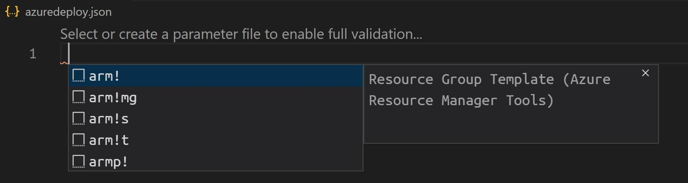

I recently started using CosmosDb at one of my client and was the first time I was using it in a real world project. That is when you start thinking of more real world scenarios too.

I wanted to set up

## The ARM Template

ARM Templates always overwhelmed me, for it's size and various attributes and values. After having discovered the ways to author them, these are less intimidating than before. I either use the [Visual Studio Resource Group Project](https://docs.microsoft.com/en-us/azure/azure-resource-manager/templates/create-visual-studio-deployment-project?WT.mc_id=AZ-MVP-5003875) or the [ARM Tools extensions for VS Code](https://marketplace.visualstudio.com/items?itemName=msazurermtools.azurerm-vscode-tools) for authoring them. This has significatly reduced the time and energy required to create an ARM template.

In this blog post I will use the VS Code Extension to create the template. The same can be achieved using the Visual Studio Project too TDK

In an empty working folder, let's create a new file for our ARM template and name it 'azuredeploy.json' (you can choose any name for the file, but will see later why I chose this specific name.). Once you have the VS Code extension for ARM Template installed, open your working folder/file in VS Code.

In an empty JSON file, typing arm or using the 'Trigger Suggest' (shortcut in VS Code, for me it is Ctrl + Space) will show a list of options to create an ARM template.

### ARM Template Parameters

## Deploying ARM Template To Azure CosmosDb

## Deployimg ARM Template To Cosmos Emulator

The Azure Cosmos emulator provides a local environment that emulates the Cosmos DB service. Having the emulator running on your local development machine, helps developing and testing your application easy. You no longer need to create an Azure subscription or incur any costs for your development team.

If you haven't downloded it before, you can [download the Azure Cosmos emulator](https://docs.microsoft.com/en-us/azure/cosmos-db/local-emulator?tabs=cli%2Cssl-netstd21#download-the-emulator&WT.mc_id=AZ-MVP-5003875) here. There are a few differences between the Emulator and the cloud service and you can [read about it in detail here](https://docs.microsoft.com/en-us/azure/cosmos-db/local-emulator?tabs=cli%2Cssl-netstd21#differences-between-the-emulator-and-the-cloud-service&WT.mc_id=AZ-MVP-5003875). Currently the emulator can be run only on Windows. If you are using Linux or Mac, you willl have to either use the cloud hosted service or in [Windows Virtual machine](https://docs.microsoft.com/en-us/azure/cosmos-db/local-emulator?tabs=cli%2Cssl-netstd21#run-on-linux-macos&WT.mc_id=AZ-MVP-5003875)
